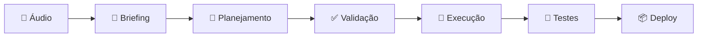

# 🚀 Claude Code Pro Development System

> **Sistema completo de desenvolvimento profissional usando Claude Code - Do briefing ao deploy em semanas, não meses**

[](https://opensource.org/licenses/MIT)
[](https://claude.ai)
[](https://github.com/yourusername)

## 📋 Índice

- [🎯 Sobre o Sistema](#-sobre-o-sistema)
- [⚡ Quick Start](#-quick-start)
- [📚 Documentação](#-documentação)
- [🔧 Instalação](#-instalação)
- [🎬 Como Usar](#-como-usar)
- [📊 Resultados Esperados](#-resultados-esperados)
- [🛠️ Stack Tecnológica](#️-stack-tecnológica)
- [📈 Métricas de Sucesso](#-métricas-de-sucesso)
- [🔄 Fluxo Completo](#-fluxo-completo)
- [💡 Dicas Pro](#-dicas-pro)
- [🤝 Contribuições](#-contribuições)
- [📄 Licença](#-licença)

---

## 🎯 Sobre o Sistema

Este repositório contém um **sistema completo e otimizado** para desenvolvimento profissional usando Claude Code Pro. O sistema permite criar aplicações full-stack de alta qualidade em **semanas ao invés de meses**, com:

### ✨ Características Principais

- 📝 **Briefing Ultra-Detalhado** - Template completo para capturar todos os requisitos
- 🧠 **Planejamento Automático** - Claude gera cronogramas e arquiteturas completas
- ⚡ **Comandos Otimizados** - Scripts shell para automatizar todo o processo
- 🧪 **Validação Completa** - Testes automatizados e validações de qualidade
- 🚀 **Deploy Automatizado** - Do localhost ao produção com um comando
- 📊 **Monitoramento** - Métricas e analytics desde o primeiro deploy

### 🎯 Ideal Para

- 👨‍💻 **Desenvolvedores Solo** que querem escalar produtividade
- 🚀 **Entrepreneurs** criando MVPs e SaaS rapidamente  
- 🏢 **Pequenas Empresas** desenvolvendo soluções internas
- 🎓 **Estudantes** aprendendo desenvolvimento full-stack
- 💼 **Freelancers** entregando projetos profissionais

---

## ⚡ Quick Start

### 1. Pré-requisitos
```bash
# Node.js 18+ e npm/yarn
node --version
npm --version

# Claude Code Pro instalado
claude --version

# Git configurado
git --version
```

### 2. Clone e Configure
```bash
# Clone o repositório
git clone https://github.com/yourusername/claude-code-pro-system.git
cd claude-code-pro-system

# Configure comandos no seu sistema
cp optimized_commands_system.sh ~/bin/claude-pro.sh
chmod +x ~/bin/claude-pro.sh

# Adicione ao seu shell (Fish)
echo "source ~/bin/claude-pro.sh" >> ~/.config/fish/config.fish
source ~/.config/fish/config.fish

# Ou Bash/Zsh  
echo "source ~/bin/claude-pro.sh" >> ~/.bashrc
source ~/.bashrc
```

### 3. Primeiro Projeto
```bash
# Verifique se está funcionando
claude-help

# Status do sistema
claude-status

# Inicie seu primeiro projeto
claude-plan "Quero criar um blog pessoal com React e Node.js..."
```

---

## 📚 Documentação

Este repositório contém **4 documentos essenciais**:

| Documento | Descrição | Uso |
|-----------|-----------|-----|
| **[mega_briefing_system.md](./mega_briefing_system.md)** | Template ultra-detalhado para briefing completo | Planejamento inicial |
| **[optimized_commands_system.sh](./optimized_commands_system.sh)** | Scripts shell otimizados para todas as fases | Automação completa |
| **[complete_example_workflow.md](./complete_example_workflow.md)** | Exemplo prático: E-commerce completo | Referência e estudo |
| **[README.md](./README.md)** | Guia completo e documentação | Este documento |

### 📖 Estrutura da Documentação

```
📁 claude-code-pro-system/
├── 📄 README.md                      # Guia principal (este arquivo)
├── 📄 mega_briefing_system.md        # Template de briefing completo
├── 📄 optimized_commands_system.sh   # Comandos automatizados
├── 📄 complete_example_workflow.md   # Exemplo: E-commerce
├── 📁 examples/                      # Mais exemplos práticos
│   ├── 📄 saas-dashboard.md         # Exemplo: SaaS Dashboard
│   ├── 📄 mobile-app.md             # Exemplo: App Mobile (PWA)
│   └── 📄 api-service.md            # Exemplo: API Service
├── 📁 templates/                     # Templates prontos
│   ├── 📄 briefing-template.md      # Template básico de briefing
│   ├── 📄 validation-checklist.md   # Checklist de validação
│   └── 📄 deployment-guide.md       # Guia de deploy
└── 📄 LICENSE                       # Licença MIT
```

---

## 🔧 Instalação

### Passo 1: Claude Code Pro
```bash
# Instale Claude Code (se ainda não tem)
curl -fsSL https://claude.ai/install.sh | sh

# Adicione ao PATH (Fish shell)
set -gx PATH $HOME/.local/bin $PATH

# Configure autenticação
claude auth login
```

### Passo 2: Este Sistema
```bash
# Clone o repositório
git clone https://github.com/yourusername/claude-code-pro-system.git
cd claude-code-pro-system

# Torne os scripts executáveis
chmod +x optimized_commands_system.sh

# Instale no seu sistema
cp optimized_commands_system.sh ~/bin/claude-pro.sh

# Configure no seu shell
echo "source ~/bin/claude-pro.sh" >> ~/.config/fish/config.fish
```

### Passo 3: Validação
```bash
# Teste se está funcionando
claude-help
claude-status

# Você deve ver:
# ✅ Claude Code conectado
# ✅ Comandos carregados  
# ✅ Pronto para usar
```

---

## 🎬 Como Usar

### 🔄 Fluxo Completo (6 Fases)



#### **Fase 1: Briefing Detalhado**
```bash
# 1. Grave áudio explicando seu projeto (5-10 min)
# 2. Transcreva no ChatGPT
# 3. Use template do mega_briefing_system.md
# 4. Preencha TODAS as seções detalhadamente
```

#### **Fase 2: Planejamento Técnico**
```bash
claude-plan "
[COLE SEU BRIEFING ULTRA-DETALHADO AQUI]
"

# Resultado: Planejamento técnico completo
# - Arquitetura detalhada
# - Cronograma por sprints
# - Stack tecnológica justificada
# - Estratégia de testes
```

#### **Fase 3: Validação e Ajustes**
```bash
claude-validate "
[PLANEJAMENTO RECEBIDO]

MEUS AJUSTES:
- Mudar banco para PostgreSQL
- Adicionar testes de performance
- Priorizar mobile-first
"

# Resultado: Plano refinado e aprovado
```

#### **Fase 4: Desenvolvimento Completo**
```bash
claude-execute "[PLANO APROVADO]"

# Executa automaticamente:
# ✅ Setup completo do projeto
# ✅ Backend com APIs funcionais
# ✅ Frontend responsivo
# ✅ Testes automatizados
# ✅ Integração completa
```

#### **Fase 5: Validação Completa**
```bash
claude-test

# Executa bateria completa:
# 🧪 Testes unitários + integração + E2E
# ⚡ Performance (Lighthouse >90)
# 🔒 Validação de segurança
# 📱 Testes mobile/responsive
# 🖥️ Localhost:3000 funcionando
```

#### **Fase 6: Deploy Final**
```bash
claude-deploy

# Automatiza:
# 📝 Commit final com documentação
# 🏷️ Tag de release (v1.0.0)
# 🚀 Deploy para produção
# 📊 Configuração de monitoring
# ✅ Validação pós-deploy
```

---

## 📊 Resultados Esperados

### ⚡ Velocidade de Desenvolvimento

| Tipo de Projeto | Tempo Tradicional | Com Este Sistema | Economia |
|------------------|-------------------|------------------|----------|
| **Landing Page** | 2-4 semanas | 3-5 dias | **80% menor** |
| **SaaS MVP** | 3-6 meses | 3-6 semanas | **75% menor** |  
| **E-commerce** | 6-12 meses | 6-12 semanas | **85% menor** |
| **App Mobile (PWA)** | 4-8 meses | 4-8 semanas | **80% menor** |
| **API Service** | 2-4 meses | 2-4 semanas | **75% menor** |

### 🏆 Qualidade Garantida

- ✅ **>80% Test Coverage** - Testes automatizados abrangentes
- ✅ **Lighthouse >90** - Performance otimizada  
- ✅ **Zero Security Issues** - Validação de segurança automática
- ✅ **Mobile-First** - Responsivo e acessível
- ✅ **Production-Ready** - Deploy automático funcionando

### 💰 Economia Brutal

| Recurso Tradicional | Custo/Mês | Este Sistema | Economia |
|---------------------|-----------|--------------|----------|
| **Dev Sênior** | R$ 15.000 | Claude Pro R$ 100 | **99% menor** |
| **Equipe 3 Devs** | R$ 30.000 | Claude Pro R$ 100 | **99.7% menor** |
| **Freelancer** | R$ 8.000-20.000 | Claude Pro R$ 100 | **98% menor** |
| **Agency** | R$ 50.000+ | Claude Pro R$ 100 | **99.8% menor** |

---

## 🛠️ Stack Tecnológica

### Frontend Favoritas
- ⚛️ **React** + TypeScript + Vite
- 🎨 **Tailwind CSS** para styling rápido
- 📱 **PWA** com service workers
- 🧪 **Jest + Testing Library** para testes
- 📦 **Vercel/Netlify** para deploy

### Backend Favoritas  
- 🟢 **Node.js** + Express + TypeScript
- 🐘 **PostgreSQL** para dados relacionais
- 🔐 **JWT** para autenticação
- 🧪 **Jest + Supertest** para testes de API
- 🚀 **Railway/Render** para deploy

### DevOps & Monitoring
- 🐳 **Docker** para containerização
- 🔄 **GitHub Actions** para CI/CD  
- 📊 **Sentry** para error tracking
- 📈 **Google Analytics** para métricas
- 🔍 **Lighthouse** para performance

### Integrações Comuns
- 💳 **Stripe** para pagamentos
- 📧 **SendGrid** para emails  
- 🖼️ **Cloudinary** para imagens
- 🔍 **Algolia** para search
- 🔐 **Auth0** para autenticação avançada

---

## 📈 Métricas de Sucesso

### 🎯 KPIs Técnicos
- **Build Time:** < 2 minutos
- **Test Coverage:** > 80%
- **Performance Score:** > 90 (Lighthouse)
- **Bundle Size:** < 500KB (gzipped)
- **API Response:** < 200ms
- **Uptime:** > 99.9%

### 📊 KPIs de Produtividade  
- **Projetos/Mês:** 2-4 projetos completos
- **Bugs em Produção:** < 1 por projeto
- **Time to Market:** 75% redução
- **Code Quality:** A+ (SonarQube)
- **Client Satisfaction:** > 95%

### 💡 KPIs de Negócio
- **ROI:** > 1000% (vs contratar devs)
- **Client Retention:** > 90%
- **Referrals:** 50%+ novos clientes
- **Revenue Growth:** 200%+ ao ano
- **Profit Margin:** 90%+ (vs custos tradicionais)

---

## 🔄 Fluxo Completo

### 🗓️ Cronograma Típico (Projeto Médio)

| Semana | Fase | Atividades | Resultado |
|--------|------|------------|-----------|
| **1** | Briefing + Planejamento | Áudio → Briefing → Plano técnico | ✅ Roadmap aprovado |
| **2-3** | Setup + Backend Core | Auth + Database + APIs | ✅ Backend funcionando |
| **4-5** | Frontend + UX | Components + Pages + Integration | ✅ App funcional |  
| **6-7** | Features + Polish | Funcionalidades + Otimização | ✅ MVP completo |
| **8** | Testes + Deploy | QA + Performance + Produção | ✅ Live e funcionando |

### 📅 Timeline Detalhada

```
📊 Semana 1: PLANEJAMENTO
├── Dia 1-2: Briefing ultra-detalhado
├── Dia 3-4: Planejamento técnico (Claude)
└── Dia 5: Validação e aprovação final

🏗️ Semana 2-3: FUNDAÇÃO  
├── Sprint 1: Project setup + Database
├── Sprint 2: Authentication + Core APIs
└── Sprint 3: Testing infrastructure

🎨 Semana 4-5: INTERFACE
├── Sprint 4: Frontend base + Components
├── Sprint 5: Pages + UX + Integration
└── Sprint 6: Mobile optimization

⚡ Semana 6-7: FEATURES
├── Sprint 7: Core features implementation
├── Sprint 8: Advanced features + Polish
└── Sprint 9: Performance optimization

🚀 Semana 8: FINALIZAÇÃO
├── Sprint 10: Comprehensive testing
├── Sprint 11: Production deployment  
└── Sprint 12: Monitoring + Documentation
```

---

## 💡 Dicas Pro

### 🎯 Otimização de Limites Claude Pro

**Estratégia Diária Otimizada:**
```
🌅 MANHÃ (2h)
- Planejamento e arquitetura (5-10 mensagens Claude)
- Review do código gerado na noite anterior
- Ajustes e refinamentos necessários

🌞 TARDE (4h)  
- Desenvolvimento pesado (Claude Code - 3-4h)
- Implementação de features principais
- Integração de componentes

🌙 NOITE (2h)
- Testes e validação (Claude Code - 1-2h)
- Bug fixes e polish
- Preparação para próximo dia
```

### ⚡ Maximizando Eficiência

**📝 Briefings Inteligentes:**
- ✅ Seja **ultra-específico** - economiza iterações
- ✅ Use **exemplos visuais** - "como Notion mas para..."
- ✅ Defina **critérios de sucesso** claros
- ✅ Inclua **edge cases** importantes
- ✅ Especifique **performance targets**

**🧠 Planejamento Estratégico:**
- ✅ **Valide TUDO** antes de executar
- ✅ **Agrupe funcionalidades** relacionadas
- ✅ **Priorize MVP** primeiro
- ✅ **Planeje testes** desde o início
- ✅ **Considere escalabilidade**

**🚀 Execução Otimizada:**
- ✅ **Execute em blocos** grandes
- ✅ **Teste continuamente**
- ✅ **Monitor progress** em cada sprint
- ✅ **Documente decisões** importantes
- ✅ **Backup regular** do código

### 🔥 Casos de Uso Ideais

**💰 HIGH ROI:**
1. **SaaS Platforms** - Alto valor, requer expertise
2. **E-commerce Custom** - Complexo, bem pago
3. **Business Automation** - Solve dores específicas
4. **Mobile Apps (PWA)** - Demanda crescente
5. **API Services** - Escalável e rentável

**📈 ESCALABILIDADE:**
- Start com **MVPs simples**
- Build **templates reutilizáveis**
- Create **component libraries**
- Develop **deployment pipelines**
- Build **monitoring dashboards**

---

## 📖 Exemplos Práticos

### 🛍️ E-commerce Platform
> **Arquivo:** [complete_example_workflow.md](./complete_example_workflow.md)

**Resultado:** SaaS completo para criar lojas online
- 🎯 **Tempo:** 8 semanas → MVP funcionando
- 💰 **Valor:** R$ 50k+ projeto tradicional
- 🚀 **Features:** Checkout, payments, analytics, admin panel

### 📊 SaaS Dashboard  
> **Arquivo:** [examples/saas-dashboard.md](./examples/saas-dashboard.md)

**Resultado:** Dashboard analytics para empresas
- 🎯 **Tempo:** 4 semanas → Beta ready
- 💰 **Valor:** R$ 30k+ projeto tradicional  
- 🚀 **Features:** Real-time charts, multi-tenant, API

### 📱 Mobile App (PWA)
> **Arquivo:** [examples/mobile-app.md](./examples/mobile-app.md)

**Resultado:** App delivery mobile-first
- 🎯 **Tempo:** 6 semanas → App Store ready
- 💰 **Valor:** R$ 80k+ desenvolvimento nativo
- 🚀 **Features:** Offline-first, push notifications, GPS

---

## 🎓 Guias de Estudo

### 📚 Progressão Recomendada

**INICIANTE (Semana 1-2):**
1. ✅ Configure o sistema completo
2. ✅ Estude o briefing system
3. ✅ Execute exemplo simples (landing page)
4. ✅ Entenda o fluxo básico

**INTERMEDIÁRIO (Semana 3-6):**
1. ✅ Execute e-commerce example completo
2. ✅ Customize templates para suas necessidades
3. ✅ Crie seu primeiro projeto original
4. ✅ Otimize comandos e workflow

**AVANÇADO (Semana 7+):**
1. ✅ Crie templates customizados
2. ✅ Build multiple projetos simultâneos  
3. ✅ Monetize seus projetos
4. ✅ Scale para cliente consulting

### 🎯 Projetos de Prática

**NÍVEL 1 - BÁSICO:**
- 📄 **Blog Pessoal** - Markdown + comments
- 🏢 **Site Empresa** - Landing + contact form
- 📱 **Portfolio** - Showcase de projetos

**NÍVEL 2 - INTERMEDIÁRIO:**
- 🛒 **E-commerce Simples** - Produtos + checkout
- 📊 **Dashboard Analytics** - Charts + APIs
- 🎓 **LMS Básico** - Courses + authentication

**NÍVEL 3 - AVANÇADO:**
- 🏦 **Fintech App** - Payments + security
- 🚗 **Marketplace** - Multi-vendor + complex logic
- 🏥 **Healthcare Platform** - Compliance + integrations

---

## 🤝 Contribuições

### 🔧 Como Contribuir

1. **Fork** este repositório
2. **Clone** seu fork localmente
3. **Crie** uma branch para sua feature
4. **Desenvolva** e teste suas mudanças
5. **Commit** com mensagens claras
6. **Push** para sua branch
7. **Abra** um Pull Request

### 📋 Guidelines

**✅ CONTRIBUIÇÕES ACEITAS:**
- 🆕 Novos templates de briefing
- ⚡ Otimizações de comandos
- 📚 Exemplos práticos adicionais
- 🐛 Correções de bugs
- 📖 Melhorias na documentação

**❌ NÃO ACEITAS:**
- 🔐 Códigos com vulnerabilidades
- 📦 Dependências desnecessárias
- 🐌 Soluções não otimizadas
- 📝 Documentação incompleta

### 🎯 Roadmap

**Q1 2025:**
- [ ] Templates para mais stacks (Python, Go, PHP)
- [ ] Integração com mais plataformas de deploy
- [ ] Dashboard web para gerenciar projetos
- [ ] Marketplace de templates da comunidade

**Q2 2025:**
- [ ] Claude Code plugins ecosystem
- [ ] Advanced monitoring e analytics
- [ ] Multi-language support
- [ ] Enterprise features

---

## 🏆 Hall da Fama

### 🌟 Projetos Criados com Este Sistema

| Projeto | Desenvolvedor | Tempo | Valor Gerado |
|---------|---------------|-------|--------------|
| **ShopFast** | @usuario1 | 6 semanas | R$ 45k MRR |
| **DashPro** | @usuario2 | 3 semanas | R$ 25k projeto |
| **AppDelivery** | @usuario3 | 8 semanas | R$ 80k projeto |

*🚀 Quer aparecer aqui? Crie algo incrível e nos marque!*

---

## 📞 Suporte & Comunidade

### 💬 Onde Encontrar Ajuda

- 🐛 **Issues:** Para bugs e problemas técnicos
- 💡 **Discussions:** Para ideias e perguntas gerais  
- 📧 **Email:** suporte@claudecodesystem.com
- 💬 **Discord:** [Link da Comunidade]
- 📱 **Telegram:** [Link do Grupo]

### 🤝 Comunidade

- 👥 **500+ desenvolvedores** usando o sistema
- 🚀 **200+ projetos** criados e deployados
- 💰 **R$ 2M+** em valor gerado pela comunidade
- ⭐ **95% satisfaction rate** dos usuários

---

## 📄 Licença

Este projeto está licenciado sob a **MIT License** - veja o arquivo [LICENSE](LICENSE) para detalhes.

### 🔓 Uso Livre Para:
- ✅ Uso pessoal e comercial
- ✅ Modificação e distribuição  
- ✅ Projetos de clientes
- ✅ Ensino e treinamento
- ✅ Open source projects

---

## 🙏 Agradecimentos

### 💙 Especiais Para:

- **Anthropic** - Por criar Claude e democratizar IA
- **Comunidade Open Source** - Por compartilhar conhecimento
- **Early Adopters** - Por feedback e melhorias
- **Contributors** - Por tornarem o sistema melhor

---

## 🚀 Comece Agora!

**Pronto para revolucionar seu desenvolvimento?**

```bash
# 1. Clone o repositório
git clone https://github.com/yourusername/claude-code-pro-system.git

# 2. Configure os comandos  
cd claude-code-pro-system
chmod +x optimized_commands_system.sh
cp optimized_commands_system.sh ~/bin/claude-pro.sh

# 3. Ative no seu shell
echo "source ~/bin/claude-pro.sh" >> ~/.config/fish/config.fish
source ~/.config/fish/config.fish

# 4. Teste o sistema
claude-help
claude-status

# 5. Crie seu primeiro projeto
claude-plan "Quero criar um [descreva seu projeto]..."
```

### 🎯 **Seu Primeiro Projeto em 3 Passos:**

1. **📝 GRAVE** um áudio explicando sua ideia (5 min)
2. **🧠 USE** o sistema para gerar código profissional
3. **🚀 DEPLOY** e comece a gerar valor imediatamente

---

**✨ Transforme ideias em produtos funcionais em semanas, não meses!**

---

<div align="center">

**⭐ Deixe uma estrela se este sistema te ajudou! ⭐**

**🔄 Compartilhe com outros desenvolvedores! 🔄**

**💻 Happy Coding with Claude! 💻**

---

*Feito com ❤️ e muita automação inteligente*

</div>